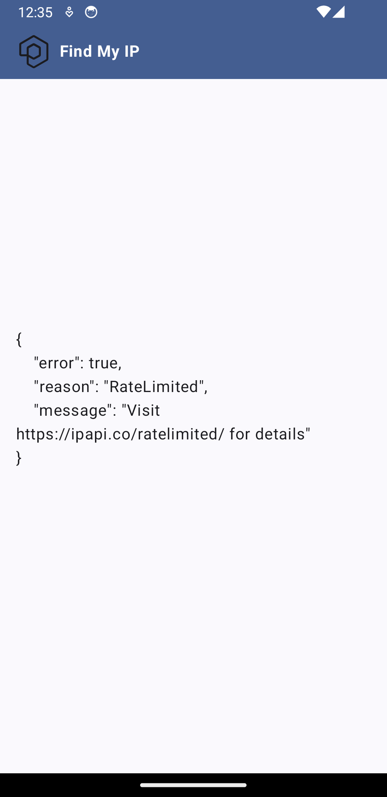
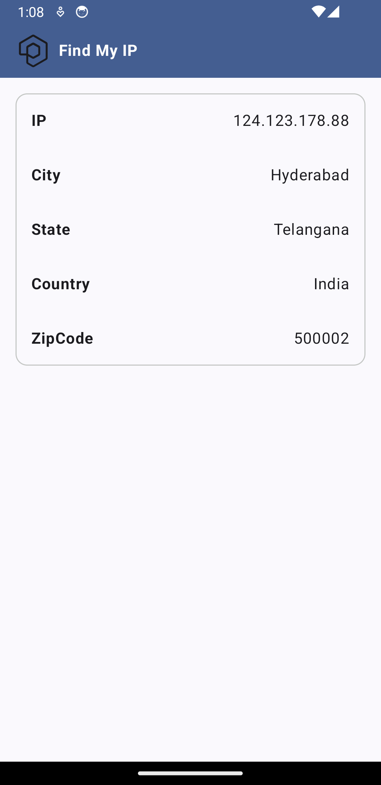

# FindMyIP
An android app that provides information about the User's public IP address and additional details about the internet connection

# Android Development
Find My IP is an Android application that strives to leverage the latest libraries and tools in Android development.

### Architecture
The Find My IP app follows the official architecture guidance.

### Modularization
The Find My IP app has been fully modularized.
Modularization is the practice of breaking the concept of a monolithic, one-module codebase into loosely coupled, self contained modules.

### Convention Plugins
The build-logic folder defines project-specific convention plugins, used to keep a single source of truth for common module configurations.

### Technology Stack
- **Language:** Kotlin
- **UI Framework:** Jetpack Compose
- **Concurrency:** Kotlin Coroutines
- **Architecture Components:** Lifecycle, Navigation
- **Dependency Injection:** Hilt

## Getting Started
To run the application locally, follow these steps:

1. Clone the repository.
2. Open the project in Android Studio.
3. Build and run the application on an Android emulator or device.

Feel free to explore the codebase and contribute to the project!

# UI
As mentioned above, this app's UI is completely written in Jetpack Compose. Some screens highlighted are:

### Screenshots

*Error*

*Loading*

*Success*

# License
Find My IP is distributed under the terms of the Apache License (Version 2.0).
